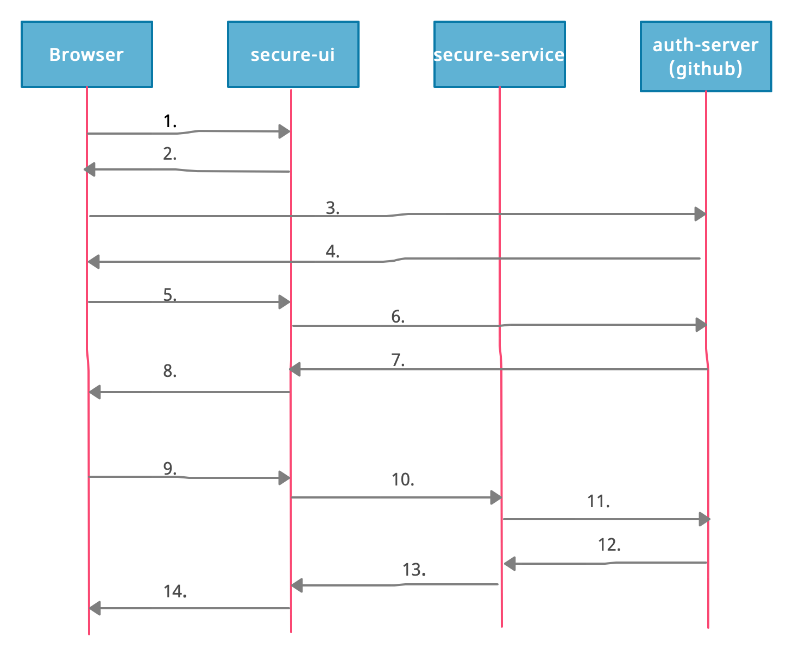

# Spring Boot Auth Server, used Github as the authentication source.

There are two apps in this project.

## secure-service:
- spring-security is enabled for this microservice and all endpoints will be authenticated using oauth token.
- It has **tollData** service which will be consumed by UI microservice.
- Services can only be consumed by passing token in Authorization header provided by Github authorization server (obtained in secure-ui service).
- Token will be authenticated by github using the url mentioned in application.properties.

## secure-ui:
- spring-security is enabled for this microservice and all endpoints will be authenticated using oauth token.
- oAuth token will be generated using Github authorization server.
- oAuth token generated by Github authorization server will be passed as Authorization header to consume **secure-service** api's.
- Below steps can enable oAuth generation automatically in spring boot app.
  - Add ```spring-boot-starter-security``` and ```spring-cloud-starter-oauth2``` as dependencies in pom.xml.
  - Add annotation ```@EnableOAuth2Sso``` in SpringbootApplication class.
  - Add below properties in application.properties file, below properties will work only on application which runs on localhost:8080, so they cannot be used for production.
    ```
    security.oauth2.client.client-id=bd1c0a783ccdd1c9b9e4
    security.oauth2.client.client-secret=1a9030fbca47a5b2c28e92f19050bb77824b5ad1
    security.oauth2.client.access-token-uri=https://github.com/login/oauth/access_token
    security.oauth2.client.user-authorization-uri=https://github.com/login/oauth/authorize
    security.oauth2.client.client-authentication-scheme=form
    security.oauth2.resource.user-info-uri=https://api.github.com/user
    security.oauth2.resource.prefer-token-info=false
    ```
    
## Architecute Explanation.


   
1. Browser makes a request to secure-ui app using url "localhost:8080/login".
2. secure-ui app checks the configuration to authenticate request, identifies oAuth is enabled, checks the properties file and redirect response with url https://github.com/login/oauth/authorize along with client_id, redirect_uri, response_type and state values.

3. Now Github login page is opened in user's browser window where user enters its credentials, provides consent and click on login button. Request with login details goes to Github server.
4. Github validates the auth request, and if credentials are correct then git server sends a redirection response with url http://locahost:8080/login along with  **Authorization Grant** to the browser. Redirection url is same which is given as a redirect_uri in step number 2. This url should also be registered with Github or any other service provider which is used for Oauth authentication. URL localhost:8080/login is not required to be registered as this will be only used for developement.

5. Now browser send request to localhost:8080/login along with code(authoriation grant) and state parameters.

6. Now secure-ui receives the request, makes call to github server (url given in property security.oauth2.client.access-token-uri) and includes authorization-grant, client-id and client-secret (available in properties file) in the request.
7. Github validates all the details received in a request, if all details are correct then it generates and return an authorization token in response.
8. secure-ui app receives authorization token and stores it to the session and sends redirection response with url localhost:8080 to the browser. Now browser dispalys the home page in the broswer. ** Authentication at this point is completed **.
9. Now enter url http://locahost:8080/reports manually in the browser. Request goes to the secure-ui app to load reports.
10. Request is being received by secure-ui app, spring-security configuration allows request to be executed since session created in above steps is valid. Now reports controller make a call to secure-service api to fetch toll-data which needs to be displayed in the browser. Since sercure-service api is also enabled with default spring-security configuration, reports controller has to include authentication-token in the request as Authorization header while calling secure-service api. In our example we have used OAuth2RestTemplate to call secure-service api, OAuth2RestTemplate will authomatically read authentication-token from OAuth2ClientContext and include it in request Authorization header.
11. secure-service api receives request, since spring-security is enabled, spring configuration will identify the type of authentication, since oAuth2 type of authentication is enabled, spring configuration will take url from properties file (available in property security.oauth2.resource.userInfoUri) and make call to that url along with authentication token to validate.
12. Gitserver receives request to authenicate token, it validates and sends success response.
13. spring configuration in sercure-service receives success response from github server, authenticates the request, executes the request and sends toll data as response.
14. secure-ui receives toll data from secure-service and sends it back to browser.
