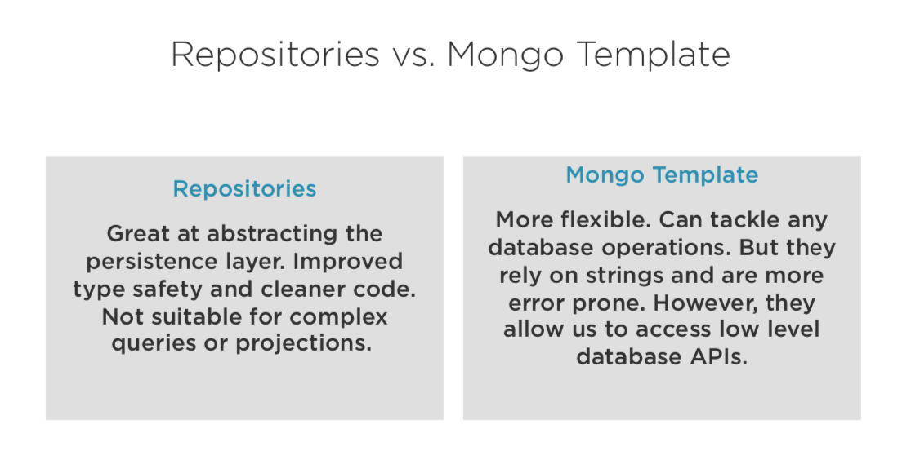

# MongoDb Sample Spring boot app for CRUD and search operations

##### Note: Integration tests are defined using embedded database ```de.flapdoodle.embed.mongo```

### Chapter1: Steps to test application doing CRUD operations using MongoDB-Template
1. Comment or delete configuration class ```DatabaseSeederRunnerUsingRepositories and DatabaseSeederRunnerUsingReferences``` to perform CRUD operations using MongoDb-Template.
2. Start the application, ```DatabaseSeederRunnerUsingMongoTemplate``` class will run after the application starts and will insert few records in MongoDb database using MongoDb-Template.
3. Test crud operations on records added in 2nd step using endpoints available in ```BasicController``` class.

### Chapter2: Steps to test application doing CRUD operations using Spring-mongo-repositories
1. Comment or delete configuration class ```DatabaseSeederRunnerUsingMongoTemplate and DatabaseSeederRunnerUsingReferences``` to perform CRUD operations using Spring-mongo-repositories.
2. Start the application, ```DatabaseSeederRunnerUsingRepositories``` class will run after the application starts and will insert few records in MongoDb database using Spring-mongo-repositories.
3. Test crud operations on records added in 2nd step using endpoints available in ```RepositoryController``` class.




### Chapter3: Run application with DB references
1. Comment or delete configuration class ```DatabaseSeederRunnerUsingRepositories and DatabaseSeederRunnerUsingMongoTemplate```.
2. Configuration class ```DatabaseSeederRunnerUsingReferences``` will run when application starts and will create flights and airports collections.
3. Cascading on save is not supported by default for references in spring. Means, when we save Flights document, airports document (child document of flights) will not be saved automatically in DB. We need to first insert airports document then need to insert flights document.
4. Workaround, automatic cascading can be acheived by hooking into life cycle events. One life cycle event is defined in class ```GenericCascadeListener``` to acheive cascading.
